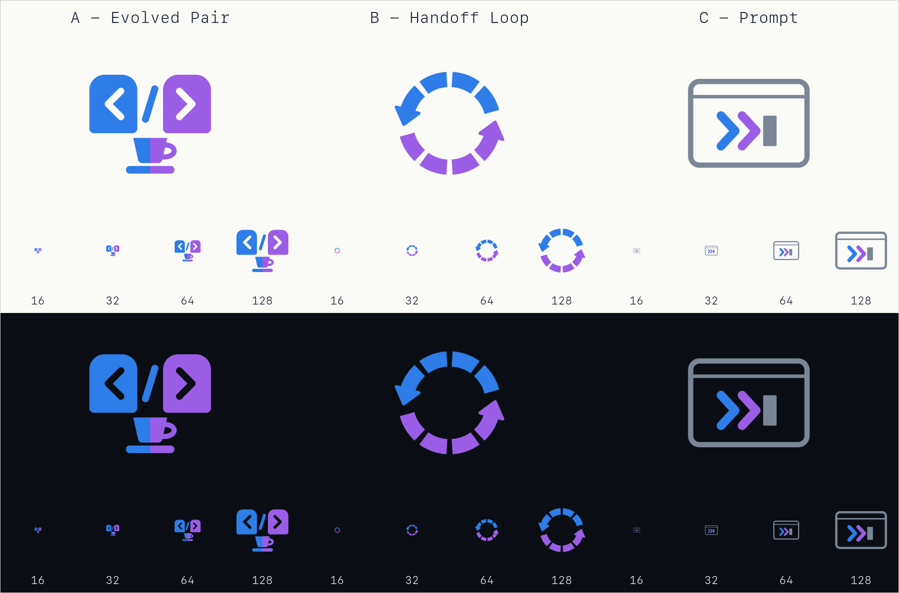

# Logo candidates

Three candidate marks for The Pair. **Nothing here is wired into the app yet** — the shipped
logo is still `resources/logo-the-pair.png`. Pick one and it gets promoted into every slot
listed under [Promoting a winner](#promoting-a-winner).

Open `preview.html` in a browser (it follows your system theme), or look at `contact-sheet.png`.



## The variants

| Key | Name         | Idea                                                                                               | Holds up at |
| --- | ------------ | -------------------------------------------------------------------------------------------------- | ----------- |
| A   | Evolved Pair | Two agent heads whose eyes are `<` and `>`, split by a `/` — together `</>`. Coffee beneath.       | 64px        |
| B   | Handoff Loop | A segmented cycle, blue handing to purple and back. The blocks are turns; the arrows are handoffs. | 32px        |
| C   | Prompt       | A terminal pane with a double caret `❯❯` and a block cursor. Closest to the app's own UI.          | 32–64px     |

Variant A carries the most story and the most detail, so it is the first to blur when small —
that is the trade-off for keeping the existing logo's DNA. B is the most scalable.

## Palette

Taken from the app's role tokens in `src/renderer/src/assets/main.css`, so the mark encodes the
two agents rather than decorating them.

| Role     | Light theme | Dark theme | Mid-tone (used in the PNGs) |
| -------- | ----------- | ---------- | --------------------------- |
| Mentor   | `#2052B6`   | `#56C3F5`  | `#2E7DE8`                   |
| Executor | `#7A37BE`   | `#CE9AF4`  | `#9B5DE5`                   |

Each SVG carries a `prefers-color-scheme: dark` override, so it re-colours itself when embedded
live. The PNGs are flat: they use the mid-tone, which clears contrast on both backgrounds.

## Files

Per variant: `variant-{a,b,c}.svg` (512×512 master, paths only — no fonts, no embedded rasters)
plus `-128`, `-512` and `-1024` PNGs with transparent backgrounds.

## Regenerating

The SVGs are the source of truth. After editing one:

```bash
npm run build:logos    # re-rasterizes all PNGs and rebuilds contact-sheet.png
npm run test:js        # tests/logoVariants.test.ts checks the masters and the rasters
```

Needs `librsvg` and `imagemagick` (`brew install librsvg imagemagick`).

## Promoting a winner

Once a variant is chosen, these are the slots that need the new mark:

| Path                                   | What it feeds                                                                                           |
| -------------------------------------- | ------------------------------------------------------------------------------------------------------- |
| `resources/logo-the-pair.png`          | README header                                                                                           |
| `docs/assets/logo-the-pair.png`        | docs + website                                                                                          |
| `docs/assets/social-preview.png`       | GitHub social card (needs a re-layout, not just a swap)                                                 |
| `src/renderer/src/assets/app-icon.png` | in-app icon                                                                                             |
| `src-tauri/icons/*`                    | bundled desktop icons — regenerate the whole set (`icon.icns`, `icon.ico`, `*.png`, `android/`, `ios/`) |

The `src-tauri/icons` set is generated, not hand-edited; `tauri icon <path-to-1024.png>` rebuilds
every size from the 1024 master.
